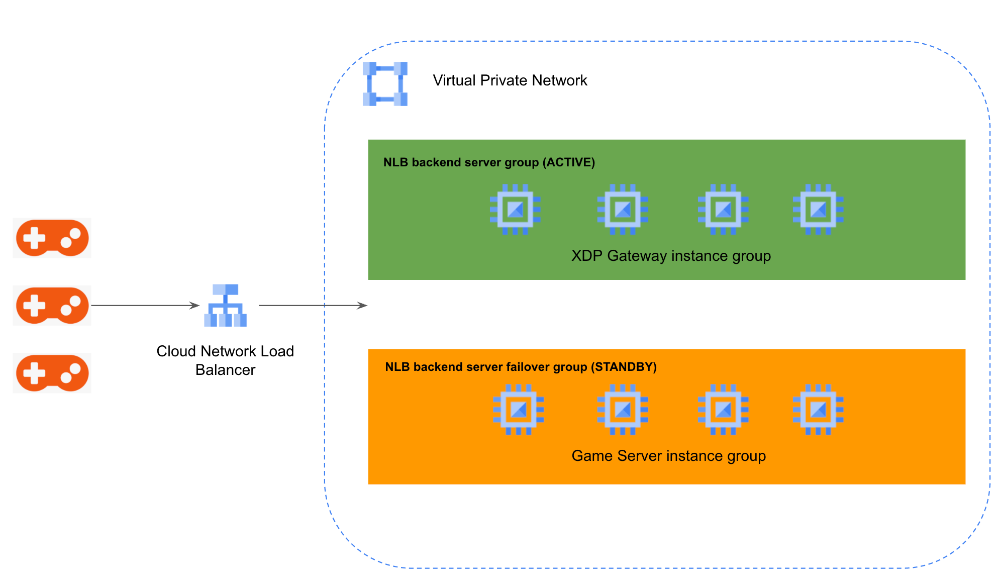
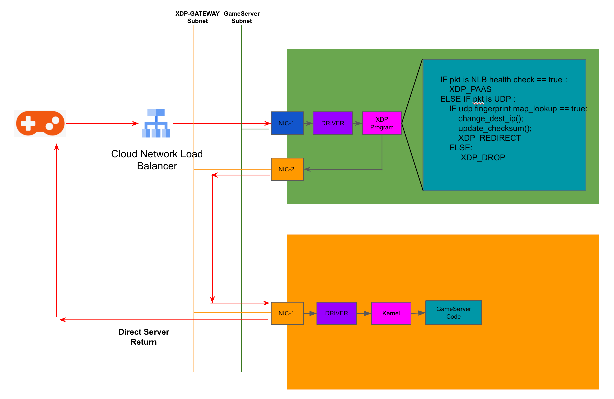

# GCloud UDP fingerprint fiter solution with XDP eBPF

An step by step guide to build up a high performance UDP fingerprint filter solution. 

* [GCloud UDP fingerprint filter solution](#gcloud-udp-fingerprint-fiter-solution-with-xdp-ebpf)
* [Overview](#overview)
  * [Solution Background](#solution-background)
  * [Architecture](#solution-architecture)
  * [Design Consideration](#design-consideration)
* [Get Started](#get-started)
## Overview
Some game genres has low latency request, so game developer has started build up game transport stack based on UDP protocol. UDP is stateless transport protocal which is vulnerable to DDoS attack. When the Game server under attack, it will exhaust all the resource of the server, then all the users serve on it will be impacted. In the industry UDP DDoS protection is hot topic, one of the effective method is token authorization, game delveloper embed authorized access token in UDP payload, anti-DDoS facility will check the token and drop the packet with unauthorized token. Some Cloud Vendor/CDN Vendor has provided this capability on its network security product. When Build self performance is a key blocker, [eBPF XDP](https://docs.cilium.io/en/stable/concepts/ebpf/intro/) is a good candidate to work as token filter with high performance. This repo target is to help you getting start to build up a eBPF XDP based UDP filter Solution on GCP(Google Cloud Platform), you can also folk this architucture on other environment.  

### Solution Background
In the demo environment, we will using GCE(Google Compute Engine) to build up a gateway tier sit between Game Server and Client. The gateway tier will host the eBPF XDP program with UDP token filter function, only the packet with anthorized token is forward to the Game Server. In the XDP program, it hosts a [eBPF MAP](https://www.slideshare.net/suselab/ebpf-maps-101) that store the forwarding rule, one unique token mapping to a game server. There also has a userspace controller code which used to program the forwarding rule in the eBPF MAP. To better optimized the performance of the XDP program, on GCP it leverage the Network Loadbalancer's [DSR(direct server return)](https://cloud.google.com/load-balancing/docs/network) capability, the return traffic can go back to client directly bypassing the gateway. 

### Architecture
This repo will give a tourial to setup a UDP gateway deployment as below architecture. Game Server will expose Internet access using GCP Cloud Network Load Balancer(NLB), with NLB XDP Gateway instance can scale-out, client traffic can distribute across the instance in the XDP Gateway Instance Group.



The packet process lifecycle is as below, client connect to the NLB public ip, then the client ingress packet is directed to the XDP Gateway Instance Group, the XDP eBPF program filter the client packet based on the UDP fingerprint in the packet, if the packet has no valid UDP fingerprint it will be dropped, the packet with valid UDP fingerprint will be redirected to the Game Serer. The Game Server Redirection forwarding logic is based on the UDP fingerprint(token) mapping, by looking up the mapping the packet's destination ip is translated to the Game Server's VPC(Virtual Private Network) internal network IP. When the packet arrive on the Game Server, Game Server can handle the packet with Game Logic. For the egress packet(return packet from Game Server), to leverage the DSR(direct server return, bypassing the Network Load Balancer) capability, on Game Server developer can setup a iptables to translate the ingress packet's destination ip address to NLB's public ip, or in the socket devlopment code, parse the egress socket's source ip to NLB's public ip.



### Design Consideration
In the design there are some key points to achieve the high performance and scalability.
#### Performance Consideration
The solution is targeted to achieve high performance with cost-optimized instance selection rule. The overall forwarding performance is depend on the instance type(GCE instance type) and instance number. Also combined with the ingress bandwidth limit on [Google Cloud VM](https://cloud.google.com/compute/docs/network-bandwidth#summary-table)(1.8M pps per instance, 20Gbps per instance), so with suitable size instance(instance with enough vcores) can achieve this bandwidth limit. There has some performance benchmark list here for customer to select their instance type. In general, instance with more vcores get more forwarding performance, XDP eBPF leverage Multi Queue process logic, GCE instance with more vcores get more [Receive/Transmit queues](https://cloud.google.com/compute/docs/network-bandwidth#rx-tx). And then for the XDP eBPF program running in the instance, there has diff [deployment mode](https://www.tigera.io/learn/guides/ebpf/ebpf-xdp/)(generic, native, offloaded), native and offloaded mode has better performance compared to native, but it needs the nic driver to support this mode, currently GCP instance not support native and offloaded mode, so when GCP instance is ready for native mode, customer can migrate to native mode to get more performance benifit. Below is per vcore pps and bandwidth benchmark.

#### Scalability Consideration
The solution is using scale-out model to achieve high performance, the XDP Gateway Instance Group and Game Server Instance Group are configed as backend of Cloud Network Load Balancer, so the maximum instance it can support depend on the maximum instance per instance group and maximum instance group that Cloud Network Load Balancer support, currently [GCP support maximum 2000 backend endpoint](https://cloud.google.com/load-balancing/docs/quotas#vms_per_instance_group) under a instance group, and maximum [50 instance groups](https://cloud.google.com/load-balancing/docs/quotas#backends) under a single Cloud Network Load Balancer. 

## Get Started
### Prepare the Google Cloud environment
$ gcpregion=xxx

$ gcpproject=yyy
#### 1. Create the virtual private network
create xdp front-end vpc
```
$ gcloud compute networks create nic1-vnet --project=$gcpproject --subnet-mode=custom --mtu=1460 --bgp-routing-mode=global
```
create xdp front-end subnet
```
$ gcloud compute networks subnets create nic1-subnet --project=$gcpproject --range=192.168.0.0/24 --stack-type=IPV4_ONLY --network=nic1-vnet --region=$gcpregion
```
create firewall policy to allow traffic on VPC front-end vpc
```
$ gcloud compute firewall-rules create nic1-vnet-allow-custom --project=$gcpproject --network=projects/$gcpproject/global/networks/nic1-vnet --description=Allows\ connection\ from\ any\ source\ to\ any\ instance\ on\ the\ network\ using\ custom\ protocols. --direction=INGRESS --priority=65534 --source-ranges=0.0.0.0/0 --action=ALLOW --rules=all
```
create xdp back-end vpc
```
$ gcloud compute networks create nic2-vnet --project=$gcpproject --subnet-mode=custom --mtu=1460 --bgp-routing-mode=global
```
create xdp back-end subnet
```
$ gcloud compute networks subnets create nic2-subnet --project=$gcpproject --range=192.168.1.0/24 --stack-type=IPV4_ONLY --network=nic2-vnet --region=$gcpregion
```
create firewall policy to allow traffic on VPC back-end vpc
```
$ gcloud compute firewall-rules create nic2-vnet-allow-custom --project=$gcpproject --network=projects/$gcpproject/global/networks/nic2-vnet --description=Allows\ connection\ from\ any\ source\ to\ any\ instance\ on\ the\ network\ using\ custom\ protocols. --direction=INGRESS --priority=65534 --source-ranges=0.0.0.0/0 --action=ALLOW --rules=all
```
#### 2. Create XDP Gateway and XDP Gateway instance group
create XDP Gateway GCE instance
```
$ gcloud compute instances create xdp-gateway-instance1 --project=$gcpproject --zone=$gcpregion-a --machine-type=n2-standard-2 --network-interface=network-tier=PREMIUM,subnet=nic1-subnet --network-interface=subnet=nic2-subnet,no-address --metadata=enable-oslogin=true --can-ip-forward --maintenance-policy=MIGRATE --provisioning-model=STANDARD --create-disk=auto-delete=yes,boot=yes,device-name=xdp-gateway-instance1,image=projects/ubuntu-os-cloud/global/images/ubuntu-2004-focal-v20220712,mode=rw,size=10,type=projects/$gcpproject/zones/$gcpregion-a/diskTypes/pd-balanced --no-shielded-secure-boot --shielded-vtpm --shielded-integrity-monitoring --reservation-affinity=any
```
create XDP Gateway Instance Group
```
$ gcloud compute instance-groups unmanaged create xdp-gateway-instance-group --project=$gcpproject --zone=$gcpregion-a
```
Add XDP Gateway GCE intance to the Instance Group
```
$ gcloud compute instance-groups unmanaged add-instances xdp-gateway-instance-group --project=$gcpproject --zone=$gcpregion-a --instances=xdp-gateway-instance1
```
#### 3. Create Game Server and Game Server instance group
create Game Server GCE instance
```
$ gcloud compute instances create game-server-instance1 --project=$gcpproject --zone=$gcpregion-a --machine-type=n2-standard-2 --network-interface=network-tier=PREMIUM,subnet=nic2-subnet --metadata=enable-oslogin=true --maintenance-policy=MIGRATE --provisioning-model=STANDARD --create-disk=auto-delete=yes,boot=yes,device-name=game-server-instance1,image=projects/ubuntu-os-cloud/global/images/ubuntu-2004-focal-v20220712,mode=rw,size=10,type=projects/project-kangwe-poc/zones/us-central1-a/diskTypes/pd-balanced --no-shielded-secure-boot --shielded-vtpm --shielded-integrity-monitoring --reservation-affinity=any
```
create Game Server Instance Group
```
$ gcloud compute instance-groups unmanaged create game-server-instance-group --project=$gcpproject --zone=$gcpregion-a
```
Add XDP Gateway GCE intance to the Instance Group
```
$ gcloud compute instance-groups unmanaged add-instances game-server-instance-group --project=$gcpproject --zone=$gcpregion-a --instances=game-server-instance1
```
#### 4. Create Cloud Network Load Balancer, XDP Gateway Instance Group as Active Backend, Game Server Instance Group as Failover Backend.
create Cloud Load Balancer Public IP
```
$ gcloud compute addresses create xdp-network-lb-ip --region $gcpregion
```
create Cloud Load Balancer Health Check Policy
```
$ gcloud compute health-checks create tcp hc-tcp-22 --region $gcpregion --port 22
```
create Cloud Load Balancer backend service
```
$ gcloud compute backend-services create xdp-network-lb-backend-service \
    --protocol udp \
    --region $gcpregion \
    --health-checks hc-tcp-22 \
    --health-checks-region $gcpregion \
    --failover-ratio 0
```
add XDP Gateway Instance Group to the Cloud Load Balancer's backend service
```
$ gcloud compute backend-services add-backend xdp-network-lb-backend-service \
    --region $gcpregion \
    --instance-group xdp-gateway-instance-group \
    --instance-group-zone $gcpregion-a
```
add Game Server Instance Group to the Cloud Load Balancer's backend service as Failover Group
```
$ gcloud compute backend-services add-backend xdp-network-lb-backend-service \
    --region $gcpregion \
    --instance-group game-server-instance-group \
    --instance-group-zone $gcpregion-a \
    --failover
```
create Cloud Load Balancer forwarding rule
```
$ gcloud compute forwarding-rules create xdp-network-lb-forwarding-rule \
    --region $gcpregion \
    --load-balancing-scheme external \
    --address xdp-network-lb-ip\
    --ports ALL \
    --ip-protocol UDP \
    --backend-service xdp-network-lb-backend-service
```
### Deploy the XDP eBPF program on XDP Gateway Instance
This Repo is using Ubuntu as the OS image, all the step-by-step guide is for Ubuntu. For other OS platform, please refer the guide [here](https://github.com/xdp-project/xdp-tutorial/blob/master/setup_dependencies.org#setup-dependencies)

install the dependencies on Ubuntu
```
$ sudo apt install clang llvm libelf-dev libpcap-dev gcc-multilib build-essential linux-tools-$(uname -r)
```
install Kernel headers dependency
```
$ sudo apt install linux-headers-$(uname -r)
```
install common tools package
```
$ sudo apt install linux-tools-common linux-tools-generic tcpdump
```
clone code to the XDP Gateway Instance
```
$ git clone https://github.com/nonokangwei/ebpfcontroller.git
$ git clone --recurse-submodules https://github.com/xdp-project/xdp-tutorial
```
copy the ebpf code to the xdp project folder
```
$ cp ./ebpfcontroller/ebpf/xdp_prog_kern.c ./xdp-tutorial/packet03-redirecting/
$ cp ./ebpfcontroller/ebpf/parsing_helpers.h ./xdp-tutorial/common/
```
### Deploy the XDP eBPF controller program on XDP Gateway Instance

### Connectivity Test with NC tool